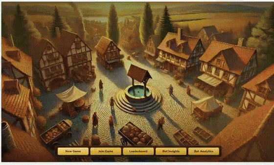

# Little Town Bot — Neural Network vs LLM for Board Game Play

> **Disclaimer:** This is a research project for educational purposes only. Not affiliated with, endorsed by, or connected to [IELLO Games](https://iellogames.com/) or the creators of Little Town.

A comparative study of two AI approaches for playing the worker-placement board game [Little Town](https://iellogames.com/games/little-town/): a custom **neural network ensemble** (ResNet + CNN) trained via SFT and REINFORCE, and a **fine-tuned LLM** (Qwen 2.5-1.5B + LoRA) trained with FSDP distributed training. Both models learn entirely from game logs — no hand-coded strategy.



**Game server** by [Carlos Yuwono](https://github.com/carllosyuwono) — the TypeScript engine that runs Little Town matches and provides the API both bots play against.

---

## Table of Contents

- [Research Question](#research-question)
- [Results Summary](#results-summary)
- [Pipeline Overview](#pipeline-overview)
- [Neural Network Branch](#neural-network-branch)
- [LLM Branch](#llm-branch)
- [Distributed Training (FSDP)](#distributed-training-fsdp)
- [Head-to-Head Results](#head-to-head-results)
- [Analysis](#analysis)
- [Deployment](#deployment)
- [Quick Start](#quick-start)
- [Project Structure](#project-structure)

---

## Research Question

**Can an LLM, given the same game data, learn to play a structured board game as well as a task-specific neural network?**

Board games present a controlled environment to compare these approaches: fixed rules, discrete actions, measurable outcomes (Victory Points and win rate). The NN branch uses a structured state vector (343 floats) and scores actions directly. The LLM branch receives the same game state as a text prompt and generates an action choice. Both are trained on identical game logs.

---

## Results Summary

### NN Ensemble vs Heuristic Bot

| Metric | Early Training (100 matches SFT) | Full Pipeline (1000 matches SFT + self-play RL) |
|--------|----------------------------------|--------------------------------------------------|
| Games evaluated | 240 | 100 |
| Win rate | 15.3% | **52.0%** |
| Avg VP | 29.9 | **33.1** |
| Avg VP (last quarter) | 29.4 | **34.9** |
| Win rate (last quarter) | 10.0% | **55.0%** |

### NN Ensemble Self-Play (RL bot vs frozen SFT checkpoint)

| Quarter | Games | RL Bot Win Rate | Avg VP | Trend |
|---------|-------|-----------------|--------|-------|
| Q1 (10–230) | 230 | 43.9% | 33.7 | RL behind frozen copy |
| Q2 (240–460) | 220 | 53.0% | 34.4 | Crossover |
| Q3 (470–690) | 220 | 58.7% | 33.8 | RL pulling ahead |
| Q4 (700–940) | 240 | **64.8%** | 32.8 | RL dominant |
| **Overall** | **940** | **55.1%** | **33.7** | Steady improvement |

### LLM (Qwen 2.5-0.5B + LoRA) vs Frozen NN Ensemble

| Metric | 100 matches SFT data | 1000 matches SFT data |
|--------|----------------------|------------------------|
| Games evaluated | 370 | 180 |
| Win rate | 0% | 0% |
| Avg VP | −15.6 | **−2.9** |
| Avg VP (last quarter) | −14.8 | **−2.9** |
| RL reward shaping | N/A | VP > 0 signal |

### Cross-Model Comparison

| Model | Opponent | Win Rate | Avg VP | Inference |
|-------|----------|----------|--------|-----------|
| **NN Ensemble (full pipeline)** | Heuristic bot | **52%** | **33.1** | ~0.1s/move (INT8 CPU) |
| **NN Ensemble (early)** | Heuristic bot | 15% | 29.9 | ~0.1s/move |
| **LLM (1000 matches)** | Frozen NN ensemble | 0% | −2.9 | ~2s/move (GPU) |
| **LLM (100 matches)** | Frozen NN ensemble | 0% | −15.6 | ~2s/move (GPU) |
| Heuristic bot | — | baseline | ~30–35 | 10s+/move (tree search) |

---

## Pipeline Overview

### Neural Network Pipeline
```
Human game logs (~100 matches)
        │
        ▼
[Stage 1] SFT on winner moves → val acc: 25%
        │
        ▼
[Stage 2] Play vs heuristic bot → 15% win rate, collect ~250 more matches
        │
        ▼
[Stage 3] Retrain SFT with combined data → val acc: 37%
        │
        ▼
[Stage 4] Self-play data generation (bot vs itself) → 6,746 → 20,912 examples
        │
        ▼
[Stage 5] Online REINFORCE vs frozen opponent (940 games) → win rate: 44% → 65%
        │
        ▼
[Stage 6] Final SFT retrain + INT8 quantisation → val acc: 51%
        │
        ▼
[Stage 7] Evaluation vs heuristic bot → win rate: 52%
```

### LLM Pipeline
```
Game logs (100 or 1000 matches)
        │
        ▼
[Stage 1] Convert game logs to text prompts via game_parser.py
        │
        ▼
[Stage 2] SFT fine-tune Qwen 2.5-0.5B with LoRA
        │   Distributed training via PyTorch FSDP (1 or 2 GPUs)
        ▼
[Stage 3] Online REINFORCE with VP > 0 reward signal
        │
        ▼
[Stage 4] Evaluation vs frozen NN ensemble → 0% win rate
```

---

## Neural Network Branch

### Architecture

Three model variants share a common **encode-then-score** pattern: encode the game state into a fixed embedding, then score each legal candidate action. This naturally handles the variable action space — sometimes 4 candidates, sometimes 483.

#### ResNet

Treats the 343-float state vector as a flat input. Pre-activation residual blocks (LayerNorm before Linear) train more stably than post-activation for small tabular networks.

```
Input: state [343]  +  candidates [N × 12]
          │
    Linear(343→84) + ReLU
    3× ResBlock:
        LayerNorm → Linear → ReLU → Dropout(0.30) → Linear → +skip
    LayerNorm → state_emb [84]
          │
    concat(state_emb[84], action[12]) → [96]
    LayerNorm → Linear(96→64→32→1) → score per candidate
          │
    [N] logits → argmax at inference / softmax+sample during RL
```

#### CNN

Splits the state into a spatial board tensor `[5×6×9]` and global scalar features `[73]`, encoding them separately before fusing. The CNN learns spatial adjacency — workers harvest from 8 surrounding cells, so local patterns matter.

```
Board [65:335] → reshape [5, 6, 9]
    Conv(5→32, k=3, BN, ReLU)    — local resource patterns
    Conv(32→64, k=3, BN, ReLU)   — mid-range building interactions
    Conv(64→64, k=3, BN, ReLU)
    Dropout2d → GlobalAvgPool → board_emb [64]

Global [0:65 + 335:343] → Linear(73→128→64) → global_emb [64]

concat(board_emb, global_emb) [128]
    2× ResBlock → LayerNorm → state_emb [128]
    ActionScorer → [N] logits
```

#### Ensemble (Score-Level Fusion)

Both branches score each candidate independently. Their logits are combined via softmax-normalised learnable weights:

```python
ensemble_logits = w_resnet * logits_resnet + w_cnn * logits_cnn
# w_resnet, w_cnn: learnable scalars, softmax-normalised (init 0.5/0.5)
```

### State Representation (343 floats)

| Section | Indices | Size | Description |
|---------|---------|------|-------------|
| Global | `[0:3]` | 3 | Round, workers remaining, turn progress |
| Per-player ×4 | `[3:35]` | 32 | Resources, VP, turn order, is_me flag — zero-padded to 4 slots |
| Bank | `[35:40]` | 5 | Resource availability |
| Market | `[40:65]` | 25 | One-hot over building IDs 1–25 |
| Board cells | `[65:335]` | 270 | 6×9 grid, 5 floats/cell: terrain, workers, building owner/ID |
| Board summary | `[335:343]` | 8 | Special building positions, castle adjacency |

> **Design note:** Variable player count (2–4) caused different state vector sizes, breaking DataLoader stacking. Fixed by always padding to 4 player slots.

### Action Representation (12 floats per candidate)

| Action | Features |
|--------|----------|
| `placeWorker` | row/5, col/8, resource deltas, n_activations, would_feed, food_ratio |
| `buildBuilding` | row/5, col/8, coin_cost/15, build_vp/15 |
| `substituteResource` | resource flags (one-hot), −3/15 cost |

### Supervised Fine-Tuning

Each example: `(state [343], candidates [N×12], correct_idx)` where `correct_idx` is the move the winner chose.

```python
scores = model(state, candidates)       # [B, max_N]
scores[~mask] = float('-inf')           # mask padding for variable N
loss = (F.cross_entropy(scores, correct_idx, reduction='none')
        * sample_weights).mean()        # VP-weighted: winner=1.1, last=−0.1
```

**Data scaling insight:** Winner-only training gives clean signal but limited examples. Using all players with VP-proportional weights tripled dataset size (350 games → ~12k examples) while maintaining signal quality.

| Hyperparameter | Value |
|---------------|-------|
| Optimizer | AdamW, lr=3e-4, wd=1e-3 |
| LR schedule | CosineAnnealing, T_max=100, eta_min=3e-6 |
| Batch size | 32 (with variable-N collate + masking) |
| Early stopping | patience=32 |
| Dropout | 0.30 |

### Reinforcement Learning (REINFORCE)

Online policy-gradient update after each game:

```python
# Reward structure
placement      = {1: +1, 2: -1.0}

# REINFORCE update
for (state, candidates, chosen_idx), G in zip(steps, returns):
    scores   = model(state, candidates)
    log_prob = F.log_softmax(scores, dim=-1)[chosen_idx]
    loss    += -G * log_prob

loss.backward()
clip_grad_norm_(model.parameters(), max_norm=1.0)
optimizer.step()
```

**Three failure modes discovered and fixed:**

1. **OOM from full-episode backward** — accumulating loss across all steps held all intermediate tensors. Fixed with per-action forward pass and immediate `del` + `torch.cuda.empty_cache()`.
2. **Return normalisation killed gradients** — when episode reward variance was low, `returns.std() ≈ 0` made all normalised returns ≈ 0. Removed normalisation; gradient clipping provides stability instead.
3. **High LR erased SFT weights** — at `lr=1e-4`, 20 losing games degraded avg VP from +34 to −7. Reduced to `lr=1e-5`; the SFT foundation remained intact.

---

## LLM Branch

### Approach

Instead of encoding the game state as a structured vector, the LLM receives a **text description** of the game state and candidate actions, generated by `game_parser.py`. The model outputs the index of its chosen action.

| Component | Detail                                                                |
|-----------|-----------------------------------------------------------------------|
| Base model | Qwen 2.5-0.5B                                                         |
| Fine-tuning | LoRA (rank 16, alpha 32, target: q_proj, v_proj)                      |
| Training | SFT on game logs → REINFORCE with VP > 0 reward                       |
| Distributed | PyTorch FSDP (see [Distributed Training](#distributed-training-fsdp)) |

### Why the LLM struggles

The LLM achieved 0% win rate against the frozen NN ensemble across all experiments. The core challenge is **structured decision-making under combinatorial constraints** — the LLM must reason about spatial board positions, resource arithmetic, multi-step feeding plans, and building adjacency bonuses, all from a serialised text representation.

Data volume helped significantly with VP (−15.6 → −2.9 with 10× more data) but was not sufficient to cross the threshold into positive-VP play. The NN's structured state vector and direct action scoring appear fundamentally better suited to this type of dense, numerical, spatially-structured decision problem.

This is a useful negative result: it establishes that for small-scale structured games, task-specific architectures with direct numerical encoding substantially outperform general-purpose LLMs fine-tuned on the same data.

---

## Distributed Training (FSDP)

The LLM SFT training uses **PyTorch Fully Sharded Data Parallel (FSDP)** to distribute Qwen 2.5-0.5B + LoRA training across multiple GPUs.

### Configuration

| Parameter | Value | Rationale |
|-----------|-------|-----------|
| Sharding strategy | `SHARD_GRAD_OP` | Model weights (1.5B, ~3GB in bf16) fit on a single GPU; only gradients and optimizer states need sharding. `FULL_SHARD` would add unnecessary all-gather overhead. |
| Mixed precision | bf16 (params, reduce, buffers) | Halves memory and compute vs float32. bf16 chosen over fp16 for numerical stability (same exponent range as float32). |
| LoRA + FSDP | `use_orig_params=True` | Required to preserve the distinction between frozen base parameters and trainable LoRA adapters. Without this, FSDP flattens all parameters and the optimizer allocates states for frozen weights, negating LoRA's memory advantage. |
| Gradient clipping | max_norm=1.0 | Prevents gradient spikes from noisy game reward signals. |
| Epochs | 3 | Convergence observed by epoch 2; epoch 3 shows minimal loss improvement. |

### Scaling Results

| Setup | Tok/s | Time/epoch | Total time | Peak GPU mem | Scaling efficiency |
|-------|-------|------------|------------|--------------|-------------------|
| 1× GPU, FSDP | 585 | 158.6 min | 7.9h | 2,479 MB | — |
| 2× GPU, FSDP | 960 | 96.6 min | 4.8h | 3,333 MB/GPU | **82%** |

| Epoch | Loss (1-GPU) | Loss (2-GPU) |
|-------|-------------|--------------|
| 1 | 0.2237 | 0.2758 |
| 2 | 0.0975 | 0.1042 |
| 3 | 0.0874 | 0.0921 |

**Observations:**

- **82% scaling efficiency** (960 / (585×2) = 0.82) — the 18% overhead comes from gradient synchronisation between GPUs, which is expected for `SHARD_GRAD_OP` on a small model.
- **Per-GPU memory increased** from 2,479 MB to 3,333 MB when moving from 1 to 2 GPUs. This is expected: `SHARD_GRAD_OP` keeps full weights on each GPU (unlike `FULL_SHARD`), and FSDP adds communication buffers. The savings come from sharding optimizer states, not weights.
- **Loss convergence is consistent** across both setups (epoch 3: 0.087 vs 0.092), confirming the distributed implementation is numerically correct — the model learns the same thing regardless of GPU count.
- **Epoch 1 loss is slightly higher on 2 GPUs** (0.276 vs 0.224). This is because the effective batch size doubles with 2 GPUs (each GPU processes the same per-GPU batch size), leading to a different optimisation trajectory in early training. By epoch 2-3, convergence aligns.

---

## Head-to-Head Results

### Data Volume Effect

| Model               | SFT Data | Opponent | Win Rate | Avg VP | VP Δ from baseline |
|---------------------|----------|----------|----------|--------|-------------------|
| NN Ensemble         | 100 matches | Heuristic bot | 15% | 29.9 | — |
| NN Ensemble         | 1000 matches + self-play RL | Heuristic bot | **52%** | **33.1** | +3.2 |
| LLM (Qwen 2.5-0.5B) | 100 matches | Frozen NN ensemble | 0% | −15.6 | — |
| LLM (Qwen 2.5-0.5B) | 1000 matches | Frozen NN ensemble | 0% | **−2.9** | +12.7 |

### RL Effect (NN Self-Play: RL bot vs frozen SFT checkpoint)

| Period | Games | Win Rate | Avg VP |
|--------|-------|----------|--------|
| Early (Q1) | 230 | 43.9% | 33.7 |
| Mid (Q2) | 220 | 53.0% | 34.4 |
| Late (Q3) | 220 | 58.7% | 33.8 |
| Final (Q4) | 240 | **64.8%** | 32.8 |

Win rate improved +20.9 percentage points while average VP remained flat — the model learned **consistency** (fewer catastrophic games) rather than higher peak scores.

---

## Analysis

### Why the NN wins

1. **Structured encoding is a massive advantage.** The NN receives 343 pre-computed floats that directly encode spatial relationships, resource counts, and building adjacency. The LLM must parse the same information from serialised text — an inherently lossy transformation.

2. **Action scoring vs generation.** The NN scores all legal actions simultaneously in a single forward pass and picks the highest. The LLM generates a response token-by-token, with no guarantee the output maps to a valid action.

3. **Data efficiency.** The NN reaches 52% win rate vs the heuristic with ~1000 matches of SFT data plus RL. The LLM with 1000 matches of data still produces negative VP.

4. **Self-play RL compounds.** The NN's encode-then-score architecture produces clean gradients for REINFORCE — each action has a direct score and log-probability. The LLM's autoregressive generation makes credit assignment noisier.

### Where the LLM shows promise

1. **Data scaling effect is clear.** VP improved from −15.6 to −2.9 with 10× more training data. The trajectory suggests that with significantly more data (10K+ matches), the LLM could potentially reach positive VP.

2. **Zero feature engineering.** The LLM requires no state vector design, no action encoding, and no custom architecture. If it worked, it would be dramatically easier to adapt to new games.

3. **Transfer potential.** A fine-tuned LLM could theoretically generalise across multiple games with different rules, whereas the NN's 343-float encoding is specific to Little Town.

### What the bot learned (NN)

These behaviours emerged through training, not explicit programming:

- **Worker feeding** — the biggest early failure mode was not feeding workers (−3 VP each). After SFT, avg VP went from −7 to +25–35.
- **Move type balance** — 69% placeWorker, 21.5% buildBuilding, 7.6% substituteResource — mirrors human winner distributions.
- **Spatial building strategy** — the CNN branch learned adjacency bonuses (Castle, Watchtower) depend on spatial positioning that the flat ResNet cannot easily model.

---

## Deployment

INT8 dynamic quantisation for CPU inference:

```python
model_int8 = torch.quantization.quantize_dynamic(
    model, {nn.Linear}, dtype=torch.qint8
)
```

Three-server architecture:

| Server | Port | Purpose |
|--------|------|---------|
| `train_nn_bot_server.py` | 9001 | RL training — gradients on |
| `frozen_nn_bot_server.py` | 9002 | Frozen opponent for self-play |
| `frozen_nn_quantize_bot_server.py` | 9003 | INT8 CPU production deployment |
| `bot_server.py` | 9000 | LLM bot server |

```bash
docker run \
  -v ./nn_rl_all_checkpoints/ensemble/v2/game_940_int8.pt:/checkpoints/model_int8.pt \
  -p 9003:9003 \
  little-town-bot
```

---

## Quick Start

```bash
# ── Neural Network ──

# 1. Generate training data
python src/SFT/generate_train_files.py --nn --winner-only --player 2

# 2. SFT (individual or ensemble)
python src/SFT/res_net/llm.py
python src/SFT/cnn/llm.py
python src/SFT/ensemble/llm.py

# 3. Self-play RL
python src/train_nn_bot_server.py         # port 9001 — updating bot
python src/frozen_nn_bot_server.py        # port 9002 — frozen opponent

# 4. Quantised deployment
QUANTIZED_CHECKPOINT=./nn_rl_all_checkpoints/ensemble/v2/game_940_int8.pt \
python src/frozen_nn_quantize_bot_server.py

# ── LLM (Distributed) ──

# 1. Generate text-format training data
python src/SFT/generate_train_files.py --llm --winner-only --player 2

# 2. SFT with FSDP (single GPU)
torchrun --nproc_per_node=1 src/SFT/trainer/fine_tuner.py

# 3. SFT with FSDP (multi-GPU)
torchrun --nproc_per_node=2 src/SFT/trainer/fine_tuner.py

# 4. LLM bot server
python src/bot_server.py                  # port 9000
```

---

## Project Structure

```
src/
├── train_nn_bot_server.py             # NN RL training server (port 9001)
├── frozen_nn_bot_server.py            # NN inference-only server (port 9002)
├── frozen_nn_quantize_bot_server.py   # NN INT8 CPU server (port 9003)
├── bot_server.py                      # LLM bot server (port 9000)
├── constant.py                        # Buildings catalogue, game constants
├── games/
│   ├── action_validator.py            # Legal move enumeration
│   ├── game_parser_nn.py              # Event log → state/candidate vectors (NN)
│   └── game_parser.py                 # Event log → text prompt (LLM)
└── SFT/
    ├── generate_train_files.py        # Game log → training data (both formats)
    ├── res_net/                        # ResNet model + trainer
    ├── cnn/                            # CNN model + trainer
    ├── ensemble/                       # Ensemble model + trainer
    └── trainer/
        └── fine_tuner.py              # LLM SFT with FSDP distributed training

stats/
├── nn_training_stats_against_itself.jsonl
├── nn_training_stats_vs_strong_heurystic_bot.jsonl
├── nn_training_stats_against_heurystic_bot_with_1000__Matches.jsonl
├── llm_training_stats_with_100__matches.jsonl
└── llm_training_stats_with_1000__matches.jsonl
```

---

## Acknowledgements

- **Game server:** [Carlos Yuwono](https://github.com/carllosyuwono) — built the TypeScript game engine that runs Little Town matches and provides the API both bots play against.
- **Game:** [Little Town](https://iellogames.com/games/little-town/) by Shun & Aya Taguchi, published by [IELLO Games](https://iellogames.com/).
- **Model:** [Qwen 2.5-0.5B](https://huggingface.co/Qwen/Qwen2.5-0.5B) by Alibaba Cloud.
